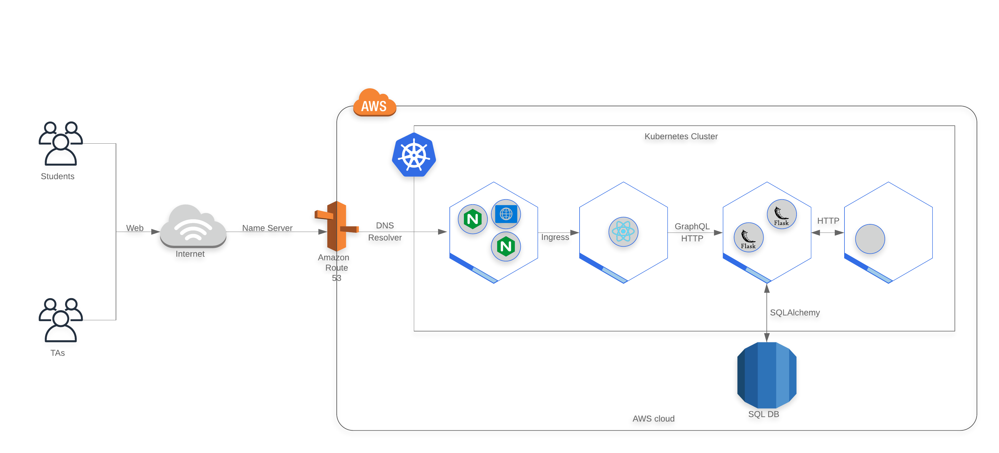

# oh-online
Office Hours online to help TAs and students during this time of remote learning

**TODO:** Place sketch of application here

## TOC
1. [Getting Started](#getting-started)
    1. [Accessing the source code](#accessing-the-source-code)
    1. [Prerequisites](#prerequisites)
    1. [Project Structure](#project-structure)
    1. [Zoom OAuth Application](#create-zoom-application)
    1. [Frontend](#frontend)
    1. [Backend](#backend)
1. [System Design](#system-design)
1. [Testing](#testing)
    1. [The Importance Of Automation](#the-importance-of-automation)
    1. [Testing Strategy](#testing-strategy)
    1. [Unit Testing](#unit-testing)
    1. [Integration Testing](#integration-testing)
    1. [Component Testing](#component-testing)
    1. [Contract Testing](#contract-testing)
    1. [End To End Testing](#end-to-end-testing)
    1. [The Test Pyramid](#the-test-pyramid)
1. [Deployment](#deployment)
    1. [Kubernetes](#kubernetes)
    1. CI / CD (TBD)
    <!-- #1. [Staging](#staging) -->
    <!-- #1. [Production](#production) -->
1. [Tools We Use](#tools-we-use)
1. [Contributing](#contributing)
1. [Author](#author)
1. [License](#license)


## Getting Started

### Accessing the source code

```bash
git clone https://github.com/bayoumi17m/oh-online.git
```

### Prerequisites

#### Run locally
- Python >= 3.6
    - Poetry
- Node 12.16 \
OR
- Docker v19.03 (Docker will install everything for you)

#### Cloud Deployment
- AWS:
    - Terraform
    - kops
    - kubectl

### Project Structure

### Create Zoom Application

### Frontend

### Backend

## System Design



## Testing

### The Impoartance of Automation

### Testing Strategy

### Unit Testing

### Integration Testing

### Component Testing

### Contract Testing

### End to End Testing

### The Test Pyramid

## Deployment

### Kubernetes

## Tools we use

- Poetry: Automatric python package management and version resolution
- Github Actions / Travis CI (TBD)
- Code Climate
- Terrafom
    - kops

## Contributing

Please read [CONTRIBUTING.md](CONTRIBUTING.md) for details on our code of conduct, the process for submitting pull requests to us, and our code review guideline.

## Authors
Magd Bayoumi - - [bayoumi17m](https://github.com/bayoumi17m)\
Cora Wu - - [cjw322](https://github.com/cjw322)\
Rishabh Sarup - - [risky998](https://github.com/risky998)\
Jerry Sun - - [JSun14](https://github.com/JSun14)\
Raye Liu - - [Raye2333](https://github.com/Raye2333)

## License
This project is maintained under MIT license